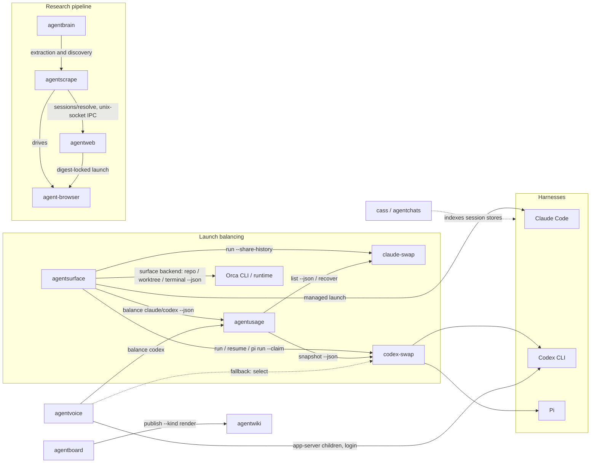
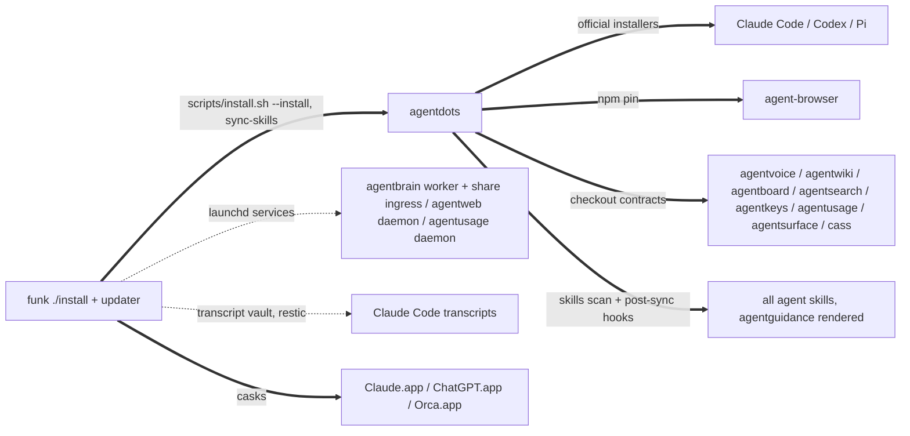
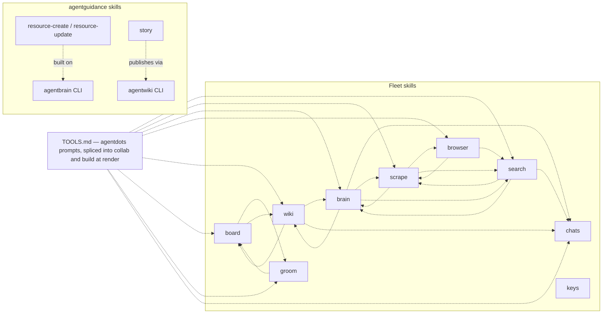

# The fleet map

Every known dependency between the agent apps in `~/code`, with evidence.
Four kinds of edge:

- **calls** (solid): a runtime subprocess invocation of another tool's CLI.
  Breaking the callee's flags or output breaks the caller.
- **routes** (dashed): a skill deliberately handing work to another skill.
  Breaking the target skill strands the routing.
- **serves** (dotted): funk-installed launchd services running fleet code,
  or a tool reading another's data on disk.
- **pins**: a binary installed at an exact version because a consumer locks
  or resolves it by contract.

## Runtime call graph

## Install and service layer

## Skill routing

An edge `X -.-> Y` means X's runbook names the `Y` skill and routes work to
it. Extracted from the SKILL.md files themselves.

The TOOLS.md node is the widest fan-out in the fleet and this repository is
its origin: `agentguidance/scripts/render` splices
`prompts/agentguidance/TOOLS.md`
into the collab and build skills at their `<!-- extension-prompt: TOOLS.md -->`
markers, so those two skills route to all eight advertised tools without
their templates naming any of them. That is why the tool-advertisement
policy (the `tool-advertisement-policy` wiki page) governs a real graph
edge, not just prose.

`keys` references no other skill and none reference it — the standalone
shape behind the decision not to advertise it in TOOLS.md.

A trap this section has already caught twice: a project's *own* `search`
subcommand (agentboard's and agentwiki's) reads exactly like a reference to
the `search` skill in a bare name-grep. Verify a routing edge from the
sentence around the match, never from the name alone.

## Edges with evidence

### calls

| Caller | Callee | What | Evidence |
| --- | --- | --- | --- |
| agentdots | agentusage | `install-agent-clis` invokes the checkout's `scripts/install.sh --install`, which provisions the public claude-swap fork and codex-swap shim before installing the observer | `agentdots/scripts/install-agent-clis`; `agentusage/scripts/install.sh:42-47` |
| agentsurface | agentusage | `agentusage balance claude\|codex --json` picks the account for a balanced launch | `agentsurface/src/balance.ts:64,124` |
| agentsurface | claude-swap | wraps balanced Claude launches as `cswap run <slot> --share-history` | `agentsurface/src/balance.ts:57-90` |
| agentsurface | codex-swap | wraps codex as `codex-swap run`/`resume <id>`, pi as `codex-swap pi run` | `agentsurface/src/balance.ts:167-180` |
| agentsurface | claude / codex / pi | launches the real harness binary (shims make bare commands balanced; `AGENTSURFACE_LAUNCH=1` breaks recursion) | `agentsurface/src/launch.ts:27`; shims in `agentdots/scripts/install-agentsurface-shims` |
| agentsurface | Orca | optional surface backend: checks runtime health, resolves or creates repos/worktrees, and creates a terminal containing the finished harness command; an Orca refusal fails closed instead of launching locally | `agentsurface/src/surface-orca.ts:43-51,109-119,164-170,181-202,336-350` |
| agentusage | claude-swap | `cswap list --json` observes Claude accounts; `cswap recover <slot> --json` repairs due expired tokens; its installer converges the public fork's `main` | `agentusage/src/claude/observe.ts:235`; `src/daemon.ts:78`; `scripts/install-providers.sh` |
| agentusage | codex-swap | `codex-swap snapshot --json` observes codex accounts; paced polling | `agentusage/src/codex/observe.ts:221`, `daemon.ts:19` |
| agentvoice | codex | spawns app-server children and `codex login --device-auth` | `agentvoice/src/main.ts:253`, `src/server/appserver.ts:89,160` |
| agentvoice | agentusage → codex-swap | `agentusage balance codex`, falling back to `codex-swap select`, per spawn | `agentvoice/src/server/config-schema.ts:53`, `src/server/accounts.ts:289` |
| agentbrain | agentscrape | evidence pipeline in four argv shapes — `fetch-markdown --markdown`, `fetch-markdown --envelope --allow-private-network --max-content-bytes`, `discover-feed`, `fetch-links --preset x-timeline --limit --max-scrolls` — plus a doctor check; a flag change breaks each shape separately | `agentbrain/src/agentscrape.ts:642,1298-1306,2038,2121-2129`, `src/jobs.ts:736` |
| agentscrape | agentweb | unix-socket IPC, not a spawn: before navigating, asks the daemon `POST /v1/sessions/resolve` whether the origin has a stored signed-in session, via `AGENTSCRAPE_CONDUIT_SOCKET`/`_TOKEN_FILE`; degrades silently to unauthenticated fetching by contract, so it never surfaces in an error path | `agentscrape/src/conduit.ts:10-21,107-110`; served by `agentweb/src/ipc.ts:442-453` |
| agentscrape | agent-browser | resolves `~/.local/bin/agent-browser` first, then PATH | `agentscrape/src/browser.ts:386-391` |
| agentweb | agent-browser | daemon-only launch of the configured absolute path (default `~/Library/pnpm/bin/agent-browser`, never resolved through PATH), refused unless SHA-256 digest and version lock verify | `agentweb/src/config-schema.ts:51,83`, `src/paths.ts:268` |
| agentboard | agentwiki | `agentwiki publish <file> --name agentboard --kind render --json` | `agentboard/src/cli.ts:834-843` |

### serves / data

| From | To | What | Evidence |
| --- | --- | --- | --- |
| funk | agentbrain, agentweb, agentusage | resident launchd services (worker, share ingress, daemons) run fleet code from the checkouts | `funk/libexec/install-local-services`, verified by `funk verify-local-services` |
| funk | agentscrape ↔ agentweb conduit | funk brokers the session conduit: injects `AGENTBRAIN_INSTALL_CONDUIT_SOCKET`/`_TOKEN_FILE` into agentbrain's worker, which passes them uninterpreted into the agentscrape children it spawns — "neither project may assume the other is installed", so the wiring is funk's | `funk/libexec/install-local-services:70-90`, `agentbrain/scripts/install.sh:98,103`, asserted by `funk/libexec/verify-local-services:92-105` |
| funk | Claude Code | hourly transcript vault snapshots the transcript archive with restic | `funk/libexec/install-transcript-vault-agent` |
| agentboard | agentwiki | stored data, distinct from the publish call: board items hold agentwiki slugs (`link <ref> --wiki <slug>` / `unlink`), so changing wiki's slug scheme breaks stored links even where publishing never runs | `agentboard/skills/board/SKILL.md:228-232`, reciprocated `agentwiki/skills/wiki/SKILL.md:133-134` |
| cass (agentchats) | Claude Code, Codex, Pi | builds and refreshes the search index over the local session stores; cass itself is upstream software — the official checksummed installer, gh-resolved — with only the `agentchats` state CLI linked editable from the checkout | `agentchats/scripts/install.sh:6,95,123-129,137` |
| agentkeys | funk configs | audits the interception chain across Karabiner/skhd/Ghostty/tmux/Neovim — files funk stows | `agentkeys` skill description; funk stow packages |
| agentboard, agentchats | each other's CLIs | the shared "agent* state dump" bearings convention: one cross-tool contract for state dumps, with a common ~4-chars-per-token budget | `agentboard/src/help.ts:367`, `agentchats/bin/agentchats:13`, `agentboard/src/brief.ts:140` |

### pins

| Binary | Version | Why | Evidence |
| --- | --- | --- | --- |
| agent-browser | 0.33.2 | one pin, two independent path contracts: Agentweb digest-locks the exact build and launches its configured absolute path (default `~/Library/pnpm/bin/agent-browser`, never PATH), while Agentscrape resolves the `~/.local/bin/agent-browser` link before PATH — relocating one path fixes only that consumer's half | `agentdots/scripts/install.sh` (`agent_browser_version`), `agentweb/src/config-schema.ts:51,83`, `agentweb/src/paths.ts:268`, `agentscrape/src/browser.ts:386` |
| @native-sdk/cli | 0.7 line | the native-sdk skill documents 0.7 and its agent helpers are version-matched | `agentdots/scripts/install.sh` (`native_sdk_version`) |
| zig | Brewfile-tracked, duplicated in the installer | AgentVoice's native duplex audio path and Native SDK packaging build against it | `agentdots/scripts/install.sh` |

### routes (skill → skill)

| From | Routes to | Notable natures |
| --- | --- | --- |
| board | groom, wiki | bulk reshaping is groom's; renders publish through wiki (see the calls edge). Board's `search` is its own subcommand, not the search skill |
| groom | board | one item is board; several at once is groom |
| brain | chats, scrape, search, wiki | checked before any web search — search is paid per call; ingestion is scrape-fed. Brain also has an own-`search` subcommand; the skill edge is genuine independently (`agentbrain/skills/brain/SKILL.md:32,172-173,382,415`) |
| scrape | brain, browser, search | scrape wants a URL in hand; finding URLs is search; interaction is browser |
| search | brain, chats, scrape | check brain first — the answer is often already local |
| browser | scrape, search | fetching content is scrape; finding pages is search |
| wiki | board, brain, chats | the durable home the others cite into. Wiki's `search` is its own subcommand, not the search skill |
| TOOLS.md (this repo) | search, scrape, brain, browser, wiki, board, groom, chats | spliced into collab and build at render — the advertisement lines are the routing |
| resource-create / resource-update (agentguidance) | brain | resources are built from and refreshed against the agentbrain index |
| story (agentguidance) | wiki | publishes the finished narrative through agentwiki |

## Checked and absent

Edges that were looked for and do not exist — recorded so the next audit
does not re-suspect them:

- agentbrain → agentsearch: no reference anywhere in `agentbrain/src`;
  ingestion is purely scrape-fed (checked 2026-08-09).
- agentvoice → agentboard / agentwiki: the orchestrator's app-server
  threads drive codex only; no board or wiki reference in `agentvoice/src`
  (checked 2026-08-09).

Last verified: 2026-08-09, twice — an initial first-hand sweep, then an
independent second sweep that removed two false routing edges (own-`search`
subcommands), added the conduit and TOOLS.md edges, and re-confirmed both
absences above. The Orca surface-backend edge was then added from its landed
adapter and contract tests.
