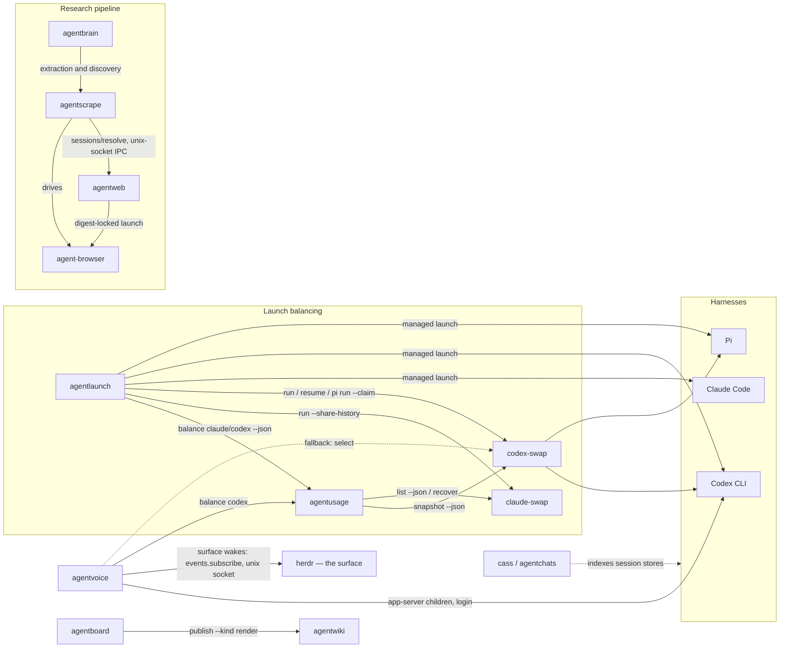
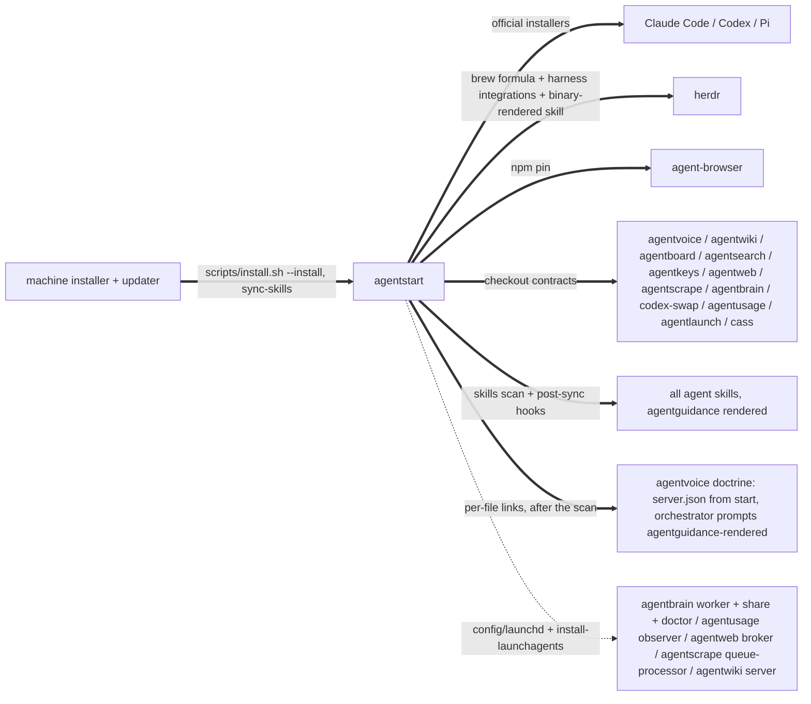
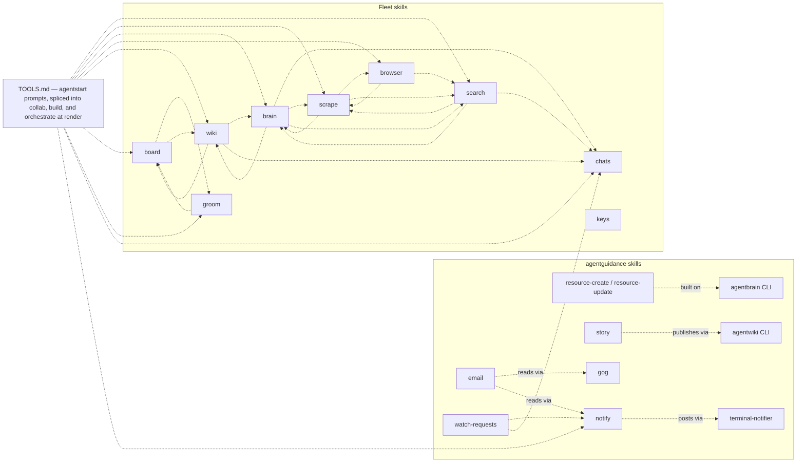

# The fleet map

Every known dependency between the agent apps in `~/code`, with evidence.
Four kinds of edge:

- **calls** (solid): a runtime subprocess invocation of another tool's CLI.
  Breaking the callee's flags or output breaks the caller.
- **routes** (dashed): a skill deliberately handing work to another skill.
  Breaking the target skill strands the routing.
- **serves** (dotted): a launchd service running fleet code, or a tool
  reading another's data on disk. Every fleet service is agentstart's; the
  machine's own reverse-DNS services are outside the fleet.
- **pins**: a binary installed at an exact version because a consumer locks
  or resolves it by contract.

## Runtime call graph

## Install and service layer

## Skill routing

An edge `X -.-> Y` means X's runbook names the `Y` skill and routes work to
it. Extracted from the SKILL.md files themselves.

The TOOLS.md node is the widest fan-out in the fleet and this repository is
its origin: `agentguidance/scripts/render` splices
`prompts/agentguidance/TOOLS.md`
into the collab, build, and orchestrate skills at their
`<!-- extension-prompt: TOOLS.md -->`
markers, so those skills route to all advertised tools without
their templates naming any of them. That is why the tool-advertisement
policy (the `tool-advertisement-policy` wiki page) governs a real graph
edge, not just prose.

`keys` references no other skill and none reference it — the standalone
shape behind the decision not to advertise it in TOOLS.md. `email` is
unadvertised on the same policy but is not standalone: it routes to
`notify`, so mail work that stalls still reaches the human.

A trap this section has already caught twice: a project's *own* `search`
subcommand (agentboard's and agentwiki's) reads exactly like a reference to
the `search` skill in a bare name-grep. Verify a routing edge from the
sentence around the match, never from the name alone.

## Edges with evidence

### calls

| Caller | Callee | What | Evidence |
| --- | --- | --- | --- |
| agentstart | agentusage | `install-agent-clis` invokes the checkout's `scripts/install.sh --install`, which provisions the public claude-swap fork before installing the observer. It no longer writes a `codex-swap` shim — that command has one owner now | `agentstart/scripts/install-agent-clis`; `agentusage/scripts/install-providers.sh` |
| agentstart | codex-swap | `install-agent-clis` invokes `scripts/install.sh --install`, which writes the `codex-swap` command as a source shim into the checkout and installs the exact stock codex-multi-auth npm pin | `agentstart/scripts/install-agent-clis`; `codex-swap/scripts/install.sh` |
| agentstart | agentlaunch | `install-agent-clis` invokes `scripts/install.sh --install` after `agentusage`; `scripts/install-agentlaunch-shims` is the external shim contract for bare `claude`/`codex`/`pi` | `agentstart/scripts/install-agent-clis`; `agentstart/scripts/install-agentlaunch-shims` |
| agentlaunch | agentusage | `agentusage balance claude\|codex --json` chooses a balanced account. Real Codex/Pi launches add `--claim`; dry runs do not reserve capacity | `agentlaunch/src/balance.ts` (`balanceClaude`, `balanceCodexFamily`) |
| agentlaunch | claude-swap | wraps balanced Claude launches as `cswap run <slot> --share-history -- <native argv>` | `agentlaunch/src/balance.ts` (`balanceClaude`); `agentlaunch/docs/adr/0003-balanced-launches-compose-a-prefix.md` |
| agentlaunch | codex-swap | wraps Codex opens as `codex-swap run`, Codex resumes as `codex-swap resume <id>`, and Pi as `codex-swap pi run`, with `--claim <lease>` for real Codex/Pi launches and `--account <key>` for dry runs or explicit pins | `agentlaunch/src/balance.ts` (`balanceCodexFamily`, `composeCodexFamily`); `agentlaunch/docs/adr/0003-balanced-launches-compose-a-prefix.md` |
| agentlaunch | claude / codex / pi | launches the resolved native harness and sets `AGENTLAUNCH_LAUNCH=1`; AgentStart's bare-command shims route to `agentlaunch --x-harness <harness>` and use that sentinel to exec the real binary on descendant launches | `agentlaunch/src/launch.ts`; `agentstart/scripts/install-agentlaunch-shims`; `agentlaunch/docs/adr/0004-shims-route-bare-calls-the-sentinel-breaks-recursion.md` |
| codex-swap | codex-multi-auth | exact npm pin, currently 2.8.4. Codex-swap invokes the package-local forced-account wrapper for native Codex runs and resumes; its installer no longer binds the fleet to the patched fork | `codex-swap/package.json`; `codex-swap/src/ndy/bin-resolver.ts`; `codex-swap/scripts/install.sh` |
| agentusage | claude-swap | `cswap list --json` observes Claude accounts; `cswap recover <slot> --json` repairs due expired tokens; its installer converges the public fork's `main` | `agentusage/src/claude/observe.ts:235`; `src/daemon.ts:78`; `scripts/install-providers.sh` |
| agentusage | codex-swap | `codex-swap snapshot --json` observes codex accounts; paced polling | `agentusage/src/codex/observe.ts:221`, `daemon.ts:19` |
| agentvoice | codex | runs the resident `codex app-server` under launchd via a rendered wrapper, and `codex login --device-auth` for profile onboarding | `agentvoice/src/resident/contract.ts` (`residentArgv`), `src/resident/install.ts` (`renderWrapper`), `src/main.ts` (`accounts add`) |
| agentvoice | agentusage → codex-swap | `agentusage balance codex`, falling back to `codex-swap select`, consulted by the resident wrapper at every spawn (`pick-home`) and by the console's rotation check | `agentvoice/src/core/accounts.ts` (`selectAccount`), `src/resident/install.ts` (`runPickHome`), `src/core/runtime.ts` (`maybeRotate`) |
| agentvoice | herdr | unix-socket IPC, not a spawn: with `surface.events` on, the console holds an `events.subscribe` NDJSON stream on herdr's socket and reconciles via one-shot `agent.list` calls; pane lifecycle events for token-tagged placed workers become `<surface_report>` turns at the orchestrator | `agentvoice/src/core/surface.ts` (`HerdrSurface`), `src/core/runtime.ts` (surface wiring); enabled by `agentstart/prompts/agentvoice/server.json` |
| agentstart | herdr | `install_or_upgrade_formula herdr` (homebrew-core, the one update path), `herdr integration install claude\|codex\|pi` every run, and the surface skill rendered from `herdr --skill` into a managed pack and shipped through `skills add` — the skill converges with the formula, never a checkout | `agentstart/scripts/install.sh` (`install_herdr_integrations`, `install_herdr_skill`), asserted by `agentstart/tests/validate.sh` |
| agentbrain | agentscrape | evidence pipeline in four argv shapes — `fetch-markdown --markdown`, `fetch-markdown --envelope --allow-private-network --max-content-bytes`, `discover-feed`, `fetch-links --preset x-timeline --limit --max-scrolls` — plus a doctor check; a flag change breaks each shape separately | `agentbrain/src/agentscrape.ts:642,1298-1306,2038,2121-2129`, `src/jobs.ts:736` |
| agentscrape | agentweb | unix-socket IPC, not a spawn: before navigating, asks the daemon `POST /v1/sessions/resolve` whether the origin has a stored signed-in session, via `AGENTSCRAPE_CONDUIT_SOCKET`/`_TOKEN_FILE`; degrades silently to unauthenticated fetching by contract, so it never surfaces in an error path | `agentscrape/src/conduit.ts:10-21,107-110`; served by `agentweb/src/ipc.ts:442-453` |
| agentscrape | agent-browser | resolves `~/.local/bin/agent-browser` first, then PATH | `agentscrape/src/browser.ts:386-391` |
| agentweb | agent-browser | daemon-only launch of the configured absolute path (default `~/Library/pnpm/bin/agent-browser`, never resolved through PATH), refused unless SHA-256 digest and version lock verify | `agentweb/src/config-schema.ts:51,83`, `src/paths.ts:268` |
| agentboard | agentwiki | `agentwiki publish <file> --name agentboard --kind render --json` | `agentboard/src/cli.ts:834-843` |

### serves / data

| From | To | What | Evidence |
| --- | --- | --- | --- |
| agentstart | agentbrain, agentscrape, agentusage, agentweb, agentwiki | installs their commands too, and owns these fleet launch agents outright: agentbrain worker/share/doctor, agentusage observer, agentweb broker, agentscrape queue processor, and agentwiki server. Labels name noun roles while the manifest records resident, periodic, or queue-triggered lifecycle; every plist enters through the tool's one public binary. Templates, manifest, rendering, label replacement, and load live here so a service never has two owners racing to render it | `agentstart/config/launchd/*.plist`, `agentstart/scripts/install-launchagents`, asserted by `agentstart/tests/validate.sh` |
| machine installer | agentstart | the only inbound edge from outside the fleet: it calls `scripts/install.sh --install` and nothing else about the fleet, because agentstart installs every fleet command and every fleet service, and discovers the tailnet bind address and agentweb's conduit paths itself | `agentstart/scripts/install.sh` (the documented external interface), `agentstart/scripts/install-agent-clis`, `agentstart/scripts/install-launchagents` |
| agentstart | agentscrape ↔ agentweb conduit | brokers the session conduit, because it is the only thing that installs both: it renders agentweb's socket and token paths into the agentbrain.worker service, and the worker passes them uninterpreted into the agentscrape children it spawns | `agentstart/scripts/install-launchagents` (agentbrain.worker tokens), asserted by the machine's local-service verification |
| agentboard | agentwiki | stored data, distinct from the publish call: board items hold agentwiki slugs (`link <ref> --wiki <slug>` / `unlink`), so changing wiki's slug scheme breaks stored links even where publishing never runs | `agentboard/skills/board/SKILL.md:228-232`, reciprocated `agentwiki/skills/wiki/SKILL.md:133-134` |
| cass (agentchats) | Claude Code, Codex, Pi | builds and refreshes the search index over the local session stores; cass itself is upstream software — the official checksummed installer, gh-resolved — with only the `agentchats` state CLI linked editable from the checkout | `agentchats/scripts/install.sh:6,95,123-129,137` |
| agentchats view | cass, session stores | the transcript viewer discovers sessions through `cass sessions --json` (workspace-scoped, deduped by path) and then reads the native store files directly for fidelity and live follow — cass is discovery, never the render source | `agentchats/viewer/src/discover.ts`, `agentchats/viewer/src/tail.ts`, `agentchats/bin/agentchats` (`view`) |
| agentkeys | stowed machine configs | audits the interception chain across Karabiner/skhd/Ghostty/tmux/Neovim — files the machine layer stows | `agentkeys` skill description; the machine's stow packages |
| agentboard, agentchats | each other's CLIs | the shared "agent* state dump" bearings convention: one cross-tool contract for state dumps, with a common ~4-chars-per-token budget | `agentboard/src/help.ts:367`, `agentchats/bin/agentchats:13`, `agentboard/src/brief.ts:140` |
| agentstart statusline | claude-swap | the claude renderer names the balanced account by reading `CLAUDE_CONFIG_DIR`, whose basename claude-swap spells `<n>-<slugified-email>`; renaming that profile directory silently drops the account segment. No counterpart for codex or pi — codex-swap pins an account by swapping auth in place and exports nothing naming it | `agentstart/config/statusline/claude-statusline.sh` (balanced-account segment); `claude-swap/src/claude_swap/session.py:161-167` |
| agentguidance | agentvoice (via agentstart) | the voice orchestrator doctrine is rendered doctrine: `agentguidance/prompts/agentvoice/` templates splice the shared orchestrator fragments to `~/.agents/prompts/agentvoice/`, agentstart links the result into `~/.config/agentvoice` after sync-skills (keeping only `server.json` as its own source), and agentvoice discovers the files by name at console start | `agentguidance/scripts/render`; `agentstart/scripts/install.sh` (`link_agentvoice_config`); `agentvoice/src/core/config.ts` (`PROMPT_FILES`) |

### pins

| Binary | Version | Why | Evidence |
| --- | --- | --- | --- |
| agent-browser | 0.33.2 | one pin, two independent path contracts: Agentweb digest-locks the exact build and launches its configured absolute path (default `~/Library/pnpm/bin/agent-browser`, never PATH), while Agentscrape resolves the `~/.local/bin/agent-browser` link before PATH — relocating one path fixes only that consumer's half | `agentstart/scripts/install.sh` (`agent_browser_version`), `agentweb/src/config-schema.ts:51,83`, `agentweb/src/paths.ts:268`, `agentscrape/src/browser.ts:386` |
| @native-sdk/cli | 0.7 line | the native-sdk skill documents 0.7 and its agent helpers are version-matched | `agentstart/scripts/install.sh` (`native_sdk_version`) |
| zig | Brewfile-tracked, duplicated in the installer | AgentVoice's native duplex audio path and Native SDK packaging build against it | `agentstart/scripts/install.sh` |

The managed claude-swap fork rebases its **`integration` branch** onto upstream on every
install — every patch we carry, merged, and the only ref the installer builds
and binds — gated by that project's own CI steps and published with
`--force-with-lease` only after the gate passes. A failed rebase or gate keeps
the previously bound build bound, publishes nothing, and notifies. The fleet
repo owns its own hardened installer rather than sharing a common helper, which
would invert that ownership. A patch also offered upstream lives on its own
branch and is **not** moved by this — refreshing an open PR is a separate
operation against a different audience. Whether a fork is wired at all is a
declared constant in the owning installer, so retiring it is an edit and a
rerun; a binding hand-written into the installed shim is unwired by the next
install, which is how the codex-multi-auth one was lost once. The
`fork-rebase-policy` wiki page is the contract.

| Fork | Integration branch | Owner | Gate |
| --- | --- | --- | --- |
| `~/src/claude-swap` | `integration` | `agentusage/scripts/install-providers.sh` | `uv sync --locked && uv run pytest` |

Codex-swap no longer binds `~/src/codex-multi-auth`: it uses the exact stock
npm pin. Open upstream PRs #664 and #665 address helper cleanup for the retired
per-TUI app-server topology and are no longer needed by this fleet; AgentVoice's
independent app-server children do not use codex-swap's removed sidecars.

### routes (skill → skill)

| From | Routes to | Notable natures |
| --- | --- | --- |
| board | groom, wiki | bulk reshaping is groom's; renders publish through wiki (see the calls edge). Board's `search` is its own subcommand, not the search skill |
| groom | board | one item is board; several at once is groom |
| brain | chats, scrape, search, wiki | checked before any web search — search is paid per call; ingestion is scrape-fed. Brain also has an own-`search` subcommand; the skill edge is genuine independently (`agentbrain/skills/brain/SKILL.md:32,172-173,382,415`) |
| scrape | brain, browser, search | scrape wants a URL in hand; finding URLs is search; interaction is browser |
| search | brain, chats, scrape | check brain first — the answer is often already local |
| browser | scrape, search | fetching content is scrape; finding pages is search |
| wiki | board, brain, chats | the durable home the others cite into. Wiki's `search` is its own subcommand, not the search skill |
| TOOLS.md (this repo) | search, scrape, brain, browser, wiki, board, groom, chats, notify | spliced into collab, build, and orchestrate at render — the advertisement lines are the routing |
| orchestrate (agentguidance) | collab, build, herdr | the wielder: collab's contract holds on the conversation thread, and execution leaves as standalone briefs run under build's contract by dispatched workers (`agentguidance/skills/orchestrate/SKILL.md`, `fragments/orchestrator-conduct.md`). Dispatch runs on two lanes: the native facility for work in the orchestrator's own service, and the surface — herdr — for the work itself; both orchestrator renditions bind herdr by name and load its skill for placement mechanics |
| resource-create / resource-update (agentguidance) | brain | resources are built from and refreshed against the agentbrain index |
| story (agentguidance) | wiki | publishes the finished narrative through agentwiki |
| watch-requests (agentguidance) | chats, notify | the watch diagnoses but never authors: `cass resume <source_path> --shell` names the session that opened the request, and notify carries the resume command and steering prompt to the human (`agentguidance/skills/watch-requests/SKILL.md`) |
| email (agentguidance) | notify | a lapsed credential or consent screen needs the human, who is not reading the transcript — the stall is announced, not waited in (`agentguidance/skills/email/SKILL.md`) |

## Checked and absent

Edges that were looked for and do not exist — recorded so the next audit
does not re-suspect them:

- agentbrain → agentsearch: no reference anywhere in `agentbrain/src`;
  ingestion is purely scrape-fed (checked 2026-08-09).
- agentvoice → agentboard / agentwiki: the orchestrator's app-server
  threads drive codex only; no board or wiki reference in `agentvoice/src`
  (checked 2026-08-09).

Last verified: 2026-08-09, twice — an initial first-hand sweep, then an
independent second sweep that removed two false routing edges (own-`search`
subcommands), added the conduit and TOOLS.md edges, and re-confirmed both
absences above. Updated 2026-08-12 for the de-Orca topology: AgentLaunch owns
bare harness launch balancing, AgentStart retires AgentBus launch agents and
adapters, and TOOLS.md no longer advertises the retired bus skill. Updated
again 2026-08-12 for the orchestrator doctrine unification: agentguidance
renders the voice orchestrator prompts from shared fragments, the new
orchestrate skill wields collab and build, and AgentStart links rendered
doctrine instead of owning it. Updated again 2026-08-12 for the fleet service
taxonomy: noun-role labels, explicit lifecycle metadata, and one public binary
per tool replace daemon/command-shaped labels and separate `*d` executables.
Updated 2026-08-15 for the surface abstraction: herdr (external,
homebrew-core) becomes the orchestrator doctrine's reference launch surface —
AgentStart renders its shipped skill from the binary, agentvoice subscribes
to its events for `<surface_report>` wakes, and the orchestrate/voice
doctrine binds it by name. The `land-vs-place` and new launch-surface wiki
pages carry the ruling.
